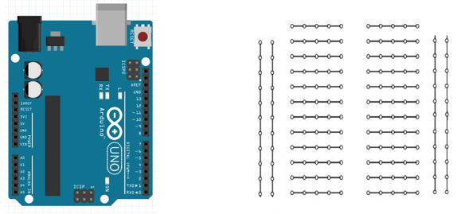

# 1ste programma

In het 1ste programma laten we een led knipperen op pin 13.

## Delen in het programma

Er zijn 3 belangrijke delen in ons eerste arduino programma:
* Definiëren van globale variabelen.
* Alles wat 1 maal uitgevoerd wordt. Voorbeeld instellen pinnen.
* Alles wat steeds moet herhaald worden.


## Invoer

Voer het eerste arduino programma in. Een mogelijk resultaat.


## Bespreking
### Setup ()

De setup() functie wordt één keer aangeroepen wanneer het programma start. Deze wordt gebruikt om pin modes te initialiseren of opzetten seriële communicatie. 

De syntax ziet er als volgt uit:  

```cpp
void setup() {
  pinMode(13, OUTPUT);  //maak van pin 13 een uitgang
}
```

### Loop ()

Nadat de setup() functie aangeroepen is volgt de loop() functie. 
Deze wordt constant doorlopen om vervolgens te reageren door veranderingen.  
De loop functie is een oneindige lus.

```cpp
void loop() {
  digitalWrite(13, HIGH);   
  // LED aan (HIGH is logisch "1")
  delay(1000);// wacht 1 seconde
  digitalWrite(13, LOW);    
  // LED uit (LOW is logisch "0")
  delay(1000);// wacht 1 seconde
}
```


### { } krullende haakjes (accolade)  

Krullende haakjes geven het begin of het einde aan van een functieblok zoals je ook tegenkomt bij de functie void loop() en void setup(). 
Het aantal accolades is altijd een even getal. 

```cpp 
void loop() {  
  // code
  			{// code
			}
}
```

Let daar goed op want één accolade te weinig en een heel programma kan stoppen met werken. 


### ; puntkomma

Een puntkomma moet gebruikt worden na elke ingevoerde opdracht. Voorbeeld:

```cpp 
digitalWrite(13, HIGH);
```
Opmerking: Vaak is het zo dat het ontbreken van een puntkomma ervoor zorgt dat de Arduino software niet wil compileren en een error aangeeft op een andere plek dan waar de puntkomma vergeten is. Dat wordt dus lastig zoeken.   


###	/*… */ blok commentaar   

Blok commentaar zijn gebieden met tekst die door het programma genegeerd worden. Tussen de /* en */ staat meestal uitleg over het programma of over de code die daar staat. Commentaar wordt nooit mee geprogrammeerd in de microcontroller. Het neemt dus geen geheugenruimte in beslag. Natuurlijk wordt het wel bewaard in het Arduino programma.


###	// regel commentaar   

Een regel die begint met // en eindigt met tekst of code zal op die regel genegeerd worden. Ook dit neemt geen geheugen in de microcontroller in beslag. Code voor in de regel gevolgd door // zal wel uitgevoerd worden alles wat na de // komt op die regel echter niet.   


### pinMode(pin, mode)   

Deze ingebouwde functie wordt meetal gebruikt in de void setup() om een specifieke pin te configureren als een INPUT of een OUTPUT en mag niet vergeten worden.

Voorbeeld:

```cpp 
pinMode(pin, OUTPUT);  //maak van “pin” een uitgang
pinMode(pin, INPUT);  //maak van “pin” een ingang
```

Opdrachten:

Pin 13 als uitgang plaatsen wordt:

```cpp 
pinMode (………………………………………………….…);
```

Pin 12 als ingang plaatsen wordt:

```cpp 
pinMode (……………………………………………………….);
```

### digitalWrite(pin, value)   

Deze ingebouwde functie digitalWrite maakt een specifieke pin hoog of laag.

```cpp 
digitalWrite(pin, HIGH);   // maak 'pin' hoog
digitalWrite(pin, LOW);   // maak 'pin' laag   
```

Opdracht:

Pin 13 hoog maken:

```cpp 
digitalWrite (…………………………..…………..);
```

### delay(ms)   

De ingebouwde functie delay(x) last een pauze van x milliseconden in.   

Voorbeeld:
```cpp 
delay(1000); // wacht een seconde   
```

##	Compileren en doorsturen

Het programma bewaren, compileren en in de arduino laden.


##	Oefeningen

* Schrijf een programma om de ingebouwde led op de arduino uno (pin 13) te laten knipperen met een aan tijd van 500 ms en een uit tijd van 1 seconde. 

* Bouw op een breadboard een schakeling om een rode led te laten knipperen (aan tijd 500 ms en uit tijd 500 ms) verbonden met pin 10 van de arduino. 

Teken hoe de externe led met voorschakelweerstand aangesloten wordt.



* Bouw een morse code generator waarbij de morse code doorgezonden wordt met de ingebouwde LED op de arduino. Morsecode bestaat uit korte en lange signalen met daartussen een korte pauze. Elke letter en elke cijfer heeft zijn eigen combinatie. De code werd uitgevonden door Samuel Morse (1835) en is een soort voorloper van de digitale communicatie. Stuur in morse code het bericht SOS door.


Een kort lichtsignaal duurt 100 ms, een lang lichtsignaal duurt 300 ms, de pauze na elke letter is 500 ms en de pauze na elk woord is 1000 ms.


