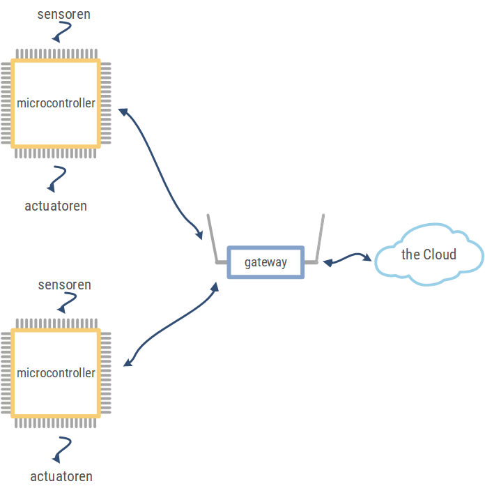

# Inleiding
## Algemeen

In het IOT-blokschema wordt de Arduino gebruikt voor communicatie met sensoren en actuatoren. Afhankelijk van het type Arduino is communicatie mogelijk met een WIFI-netwerk, LORA-netwerk, ….

## Blokschema arduino met sensoren en actuatoren

Het arduino bord bevat een microcontroller met de nodige extra componenten. Sensoren en actuatoren zijn niet opgenomen op het arduino ontwikkelbord en moeten extern geplaatst worden.

De sensoren en actuatoren nemen we zeker op in het blokschema indien deze aanwezig zijn. Voeding en communicatie indien nodig.

Sensoren lezen informatie binnen. Enkele voorbeelden.

* Temperatuursensoren.
* Grondvochtigssensoren.
* Afstandssensoren.

De verwerking verloopt via de microcontroller. In de microcontroller moet de nodige software geladen worden.

Actuatoren voeren iets uit. Enkele voorbeelden:

* Verlichting. (leds, ...)
* Motoren.

De communicatie wordt gebruikt om:

* Programma in de microcontroller op het arduino bord te laden.
* Informatie weer te geven.

## Onderzoek info arduino

Voor de verwerking kan er gebruik gemaakt worden van een arduino ontwikkelbord.  Er bestaan verschillende arduino borden. Zoek enkele verschillende types op. Kijk als de borden geschikt zijn voor communicatie met een netwerk.

## Arduino IDE

De ontwikkelomgeving Arduino IDE kan gedownload worden op *[Arduino](https://www.arduino.cc/)

Er is nog alternatieve software om arduino borden te programmeren:
* Flowcode
* Scratch 4 arduino
* Snap 4 arduino
* Ardublocks
Deze software is meestal geschikt om een basis rond programmeren aan te leren, maar voorlopig niet voor communicatie met cloud platformen.

## Arduino uno bord

Het arduino uno bord is ideaal om te leren programmeren, kennis te maken met sensoren en actuatoren, maar beschikt niet over bedrade of draadloze netwerkcommunicatie. 

De arduino UNO beschikt over volgende pinlayout:

De pinnen 0 tot en met 13 kunnen gebruikt worden als een digitale ingang of uitgang.
De pinnen A0 tot en met A5 kunnen gebruikt worden als analoge ingang.

De arduino uno maakt gebruik van TTL spanningsniveaus. 

Verklaring:
* VOH is de minimale spanning aan de uitgang voor een logisch “1”
* VOL is de maximale spanning aan de uitgang voor een logisch “0”
* VIH is de minimale spanning aan de ingang voor een logisch “1”
* VIL is de maximale spanning aan de ingang voor een logisch “0”

Oefening:

* Een ingangsspanning tussen de 0 V en 0,8 V wordt aanzien als? 	
* Een ingangsspanning tussen de 2 V en 5 V wordt aanzien als?	
* Een uitgangsspanning tussen de 0 V en 0,4 V wordt aanzien als? 	
* Een uitgangsspanning tussen de 2,7 V en 5 V wordt aanzien als? 	

## Instellen correcte type arduino bord

Er zijn heel wat verschillende types arduino’s. Kies in de software het gebruikte bord.

## Instellen communicatie poort

De communicatiepoort tussen computer en arduino bord moet eveneens ingesteld worden.

