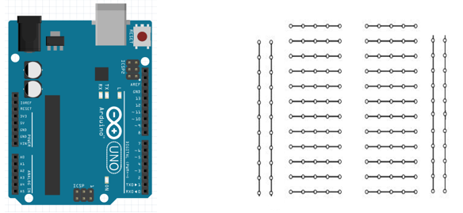
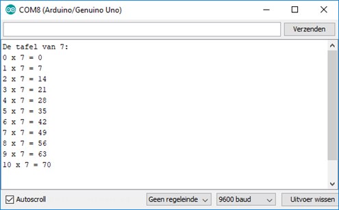
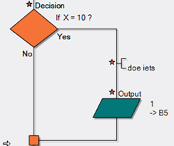
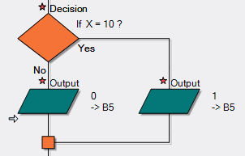
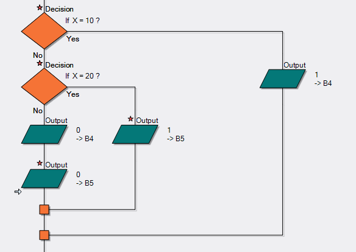

# Controlestructuren
##	For loop

De for lus herhaalt een actie een vooraf vastgesteld aantal malen. 

De syntax:

```cpp
for (startwaarde; voorwaarde om te stoppen; aanpassing)  
{ doeiets;  
} 
```

Een voorbeeld:  
```cpp
/*declareer i en test of i kleiner is dan 20, telkens de for
  lus doorlopen wordt, wordt i met 1 verhoogd.*/
  for (int i=0; i<20; i++)                  
   {digitalWrite(LEDPin, HIGH);  // zet LEDPin aan  
    delay(onTime);              // pauze 
    digitalWrite(LEDPin, LOW);  // zet LEDPin uit  
    delay(offTime);             // pauze 
    }
```

### Oefeningen

* Ontwerp een programma om de ingebouwde led verbonden met pin 13 tien maal te laten knipperen met een aan tijd van 500 ms en uit tijd van 500 ms. 

* Bouw op een breadboard een schakeling om een rode led 10 maal te laten knipperen (aan tijd 100 ms en uit tijd 200 ms) verbonden met pin 10 van de arduino. Vervolgens moet een groene led 5 maal knipperen (aan tijd 100 ms en uit tijd  200 ms) verbonden met pin 11 van de arduino. 

Teken het aansluitschema met Arduino en breadboard.




* Ontwerp een programma waarbij de getallen van 0 tot 25 onder elkaar weergegeven worden in de seriële monitor. Bewaar het programma als “prog 3 for loop”.
* Ontwerp een programma om de tafel van 7 weer te geven in de seriële monitor. Zie onderstaande resultaat.




##	If

De if structuur test of bepaalde condities bereikt zijn. In dat geval moet er iets gebeuren. Die actie moet dan plaats vinden binnen de haakjes (zie het voorbeeld hier onder). Wordt er niet aan de voorwaarde voldaan dan wordt de actie tussen de haakjes overgeslagen. 

Voorbeeld:  
```cpp
if (voorwaarde)  {     Doe iets indien aan de voorwaarde voldaan;  }   
```
De voorwaarde moet waar of niet waar zijn.

Enkele mogelijkheden voor de voorwaarde:

x == y (x is gelijk aan y)
x != y (x is niet gelijk aan y)
x <  y (x is kleiner dan y)
x >  y (x is groter dan y)
x <= y (x is kleiner of gelijk aan y)
x >= y (x is groter of gelijk aan y)

Voorbeelden:
```cpp
if (x==10)  {     Doe iets;  }   
if (x>10)   {     Doe iets;  }
if (x<10)   {     Doe iets;  }
```



Opmerking: Pas op met **if(x=10)**.  Dit is technisch gezien juist. Het geeft x de waarde 10 en heeft als resultaat altijd TRUE. Gebruik **==**.

/
### Oefeningen

* Ontwerp een programma om de ingebouwde led verbonden met pin 13 tienmaal te laten knipperen met een aan tijd van 500 ms en uit tijd van 500 ms. Bewaar het programma als “prog 1 if”.

* Ontwerp een programma waarbij de getallen van 0 tot 10 onder elkaar weergegeven worden in de seriële monitor. Bewaar het programma als “prog 2 if”.

##	 If … else

De if… else structuur maakt het mogelijk hoe dan ook iets uit te voeren.  Bijvoorbeeld je meet dat een digitale input pin hoog is, in dat geval wil je dat actie A start. Is de pin echter laag dan moet actie B starten. 

Dat zou er als volgt uit kunnen zien:
 
 ```cpp
if (voorwaarde)  
  {Doe iets indien aan de voorwaarde voldaan;  
  } 
else
  {Doe iets als niet aan de voorwaarde voldaan is;  
  }   
```
Enkele mogelijkheden voor de voorwaarde:

x == y (x is gelijk aan y)
x != y (x is niet gelijk aan y)
x <  y (x is kleiner dan y)
x >  y (x is groter dan y)
x <= y (x is kleiner of gelijk aan y)
x >= y (x is groter of gelijk aan y)



### Oefening

* Ontwerp een programma om de ingebouwde led verbonden met pin 13 tienmaal te laten knipperen met een aan tijd van 500 ms en uit tijd van 500 ms en vervolgens met een aan tijd van 1 seconde en een uit tijd van 1 seconde. 

## If … elseif … else

Met if… elseif… else kunnen meerdere toestanden gecontroleerd worden.

Voorbeeld:

 ```cpp
if (voorwaarde 1)  
  {Doe iets indien aan voorwaarde 1 voldaan is;  
  } 
else if (voorwaarde 2)
  {Doe iets indien aan voorwaarde 2 voldaan is;  
  } 
else
  {Doe iets als niet aan de voorwaarde voldaan is;  
  }   
```




### Oefeningen

•	Ontwerp een programma om rapport commentaar te geven. Maak gebruik van de If .. elseif .. else  structuur. De invoer verloopt via een vraag in de serial monitor, de weergave eveneens.

| Behaalde uitslag |	Commentaar |
| --- | --- |
| Meer dan 90	 | Schitterend gewerkt! |
| Van 80 tot (en met) 90	| Zeer goed gewerkt! |
| Van 70 tot 80	| Goed gewerkt! |
| Van 60 tot 70 |	Voldoende |
| Van 50 tot 60	| Geslaagd |
| Minder dan 50	| Onvoldoende |

 ## While loop (voorwaardelijke lus)

Een while loop wordt doorlopen zolang aan de voorwaarde voldaan is. In onderstaande voorbeeld zolang de teller<50.

```cpp
void loop() {
  // put your main code here, to run repeatedly:
  while (teller < 50) { //doorloop de lus zolang teller kleiner is dan 50
    digitalWrite(LED_BUILTIN, HIGH); //ingebouwde led aan
    delay(1000);
    digitalWrite(LED_BUILTIN, LOW); //ingebouwde led uit
    delay(1000);
  }
 ```

### Oefening:

•	Laat de led verbonden met pin 13 eerst 10 maal knipperen met een frequentie van 1 Hz, en vervolgens 10 maal knipperen met een frequentie van 0,5 Hz. 


## Do while loop (voorwaardelijke lus)

Een do while loop wordt doorlopen zolang aan de voorwaarde voldaan is.  Er wordt op het einde getest waardoor de lus minimaal 1 maal doorlopen wordt. In onderstaande voorbeeld zolang de teller<50.

```cpp
void loop() {
  // put your main code here, to run repeatedly:
  do {       // lus doorlopen zolang teller kleiner is dan 50
    digitalWrite(13, HIGH);   // Led aan
    delay(50);
    digitalWrite(13, LOW);   // Led uit
    delay(50);
    Serial.println(teller);
    teller++;               //teller met 1 verhogen
  }  while (teller < 50); // lus doorlopen zolang teller kleiner is dan 50
  while (1);       // programma laten vastlopen op deze regel.
}
```

### Oefening:


•	Laat de led verbonden met pin 13 eerst 10 maal knipperen met een frequentie van 1 Hz, en vervolgens 10 maal knipperen met een frequentie van 0,5 Hz. Bewaar het als “prog 2  dowhile” in de map arduino.

## Switch case structuur

Via een switch structuur kan bepaald worden welke case uitgevoerd wordt.

```cpp
# define LED1 13
# define LED2 12
# define LED3 11
int keuze = 0;
void setup() {
  // put your setup code here, to run once:
  Serial.begin(9600);
  pinMode(LED1, OUTPUT);
  pinMode(LED2, OUTPUT);
  pinMode(LED3, OUTPUT);
}

void loop() {
  // put your main code here, to run repeatedly:
  Serial.println("Kies welke led moet oplichten (1,2 of 3)");
  while (Serial.available() == 0) {
  }
  keuze = Serial.parseInt();    //Keuze omzetten naar int
  switch (keuze) {              //Case die gelijk is aan keuze wordt uitgevoerd
    case 1:
      digitalWrite(LED1, HIGH);
      digitalWrite(LED2, LOW);
      digitalWrite(LED3, LOW);
      break;
    case 2:
      digitalWrite(LED1, LOW);
      digitalWrite(LED2, HIGH);
      digitalWrite(LED3, LOW);
      break;
    case 3:
      digitalWrite(LED1, LOW);
      digitalWrite(LED2, LOW);
      digitalWrite(LED3, HIGH);
      break;
    default:          //indien geen van de keuzes
      digitalWrite(LED1, LOW);
      digitalWrite(LED2, LOW);
      digitalWrite(LED3, LOW);
      break;
  }
}
```

### Oefeningen

•	Ontwerp een programma om rapport commentaar te geven. Maak gebruik van de switch-case structuur. De invoer verloopt via een vraag in de serial monitor, de weergave eveneens.

| Behaalde uitslag |	Commentaar |
| --- | --- |
| Meer dan 90	 | Schitterend gewerkt! |
| Van 80 tot (en met) 90	| Zeer goed gewerkt! |
| Van 70 tot 80	| Goed gewerkt! |
| Van 60 tot 70 |	Voldoende |
| Van 50 tot 60	| Geslaagd |
| Minder dan 50	| Onvoldoende |

