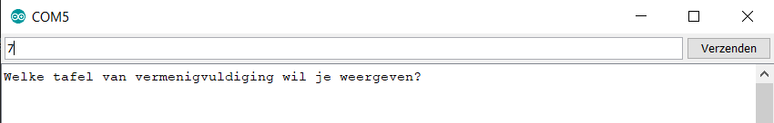

# Informatie van computer ontvangen

Het is mogelijk informatie in te voeren in de serial monitor en deze te gebruiken in de arduino.



In onderstaande voorbeeld kan de gebruiker ingeven welke tafel van vermenigvuldiging moet weergegeven worden.

```cpp
int tafel = 0;
void setup() {
  // put your setup code here, to run once:
  Serial.begin(9600);
}

void loop() {
  // put your main code here, to run repeatedly:
  Serial.println("Welke tafel van vermenigvuliding wil je weergeven");
  while (Serial.available() == 0) { //Wacht op data van de gebruiker
  }
  tafel = Serial.parseInt(); //Zet de data van de gebruiker om van een
  //String naar een integer

  for (int i = 1; i <= 10; i++) { //for loop om alle waardes van de tafel weer te geven
    Serial.print(i);
    Serial.print(" x ");  //tekst
    Serial.print(tafel);
    Serial.print(" = ");
    Serial.println(i * tafel); //Resultaat
  }
}
```

Door volgende regel wordt er gewacht tot informatie ingegeven wordt:

```cpp
while(Serial.available()==0) {//Wacht op data van de gebruiker
  }
```

Met volgende regel wordt de data afkomstig van de seriële monitor omzet in een integer en bewaard in een variabele:

```cpp
tafel=Serial.parseInt();//lees de data van de gebruiker binnen
```


Oefeningen:

* Schrijf een programma waarbij de gebruiker ingeeft op computer hoeveel maal de led verbonden met pin 13 moet knipperen. 
* Schrijf een programma waarbij de gebruiker ingeeft op computer hoeveel maal de led verbonden met pin 13 moet knipperen, hoelang de aan tijd is van de led en hoelang de uit tijd is van de led. 
* Schrijf een programma waarbij de gebruiker in de seriële monitor ingeeft welke leds er moeten oplichten. Er zijn leds verbonden met de pinnen 6,7 en 13. 


