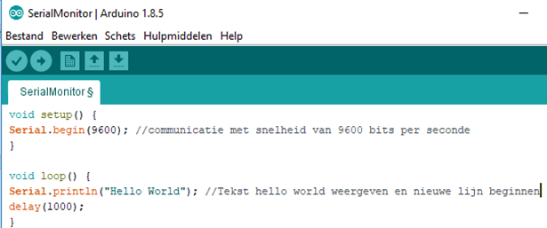
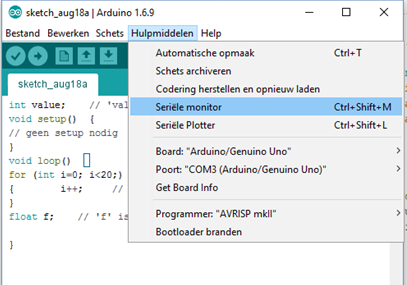

# Informatie naar computer sturen

Soms kan het handig zijn om informatie vanuit de Arduino naar een computer te sturen. Bij arduino is dit via onderstaande voorbeeld mogelijk.  Test onderstaande programma uit.



Met ```cpp Serial.begin(9600); ``` wordt de communicatiesnelheid ingesteld op 9600 bits/seconde.
Met ```cpp Serial.println(“Hello world”); ``` wordt iedere seconde de tekst “Hello world” weergegeven in de serial monitor van bovenstaande programma.

De Seriële monitor kan je op volgende manier openen:



## Oefeningen


* Onderzoek wat het verschil is tussen Serial.println en Serial.print.

* In welke functie moet je Serial.println plaatsen als je wil dat de tekst maar 1 maal weergegeven wordt.
