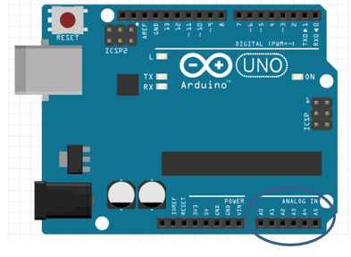
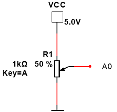
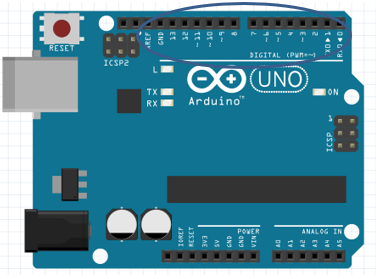
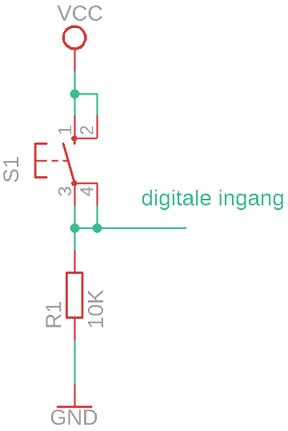
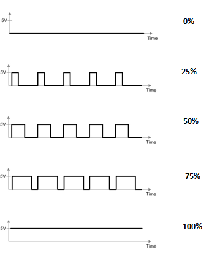

# Ingebouwde functies

Voor arduino zijn er heel wat ingebouwde functies beschikbaar. Een kort overzicht van enkele bruikbare functies.

## analogRead

In de arduino uno is een 10 bit analoog naar digitaal convertor aanwezig. Deze kan gebruikt worden op de ingangen A0 tot en met A5. Met de functie analogRead wordt een analoge waarde omgezet naar een getal.



In onderstaande schema wordt een analoge spanning gegenereerd met een potentiometer.



Voorbeeld:

```cpp
#define potPen A0
int readValue;

void setup() {
  // put your setup code here, to run once:
  Serial.begin (9600);
}

void loop() {
  // put your main code here, to run repeatedly:
  readValue = analogRead(potPen); //analoge spanning omzetten naar een getal en bewaren in de variabele readValue
  Serial.print("Analoge waarde: ");
  Serial.println(readValue); //Weergave waarde
  delay(1000);
}
```
### Oefeningen

* Schrijf een programma waarbij de ingebouwde led van de arduino oplicht wanneer de spanning aan ingang A0 groter is dan 2 V. Geef eveneens de decimale waarde weer in de seriële monitor. Gebruik een potentiometer.

* Schrijf een programma waarbij de ingebouwde led van de arduino oplicht wanneer de spanning aan ingang A0 tussen de 2 V en 3 V is. Gebruik onderstaande schakeling.  Geef eveneens de decimale waarde weer in de seriële monitor.

## digitalRead

De pinnen 0 tot en met 13 zijn geschikt als digitale ingang. Met de functie digitalRead kan de toestand van een pin ingelezen worden.



Via volgende schakeling kan een logische "0" of "1" gegenereerd worden op een ingangspin.



Reken de spanning tussen de digitale ingang en de massa na wanneer de drukknop ingedrukt is en wanneer de drukknop niet ingedrukt is.

In onderstaande voorbeeld licht de ingebouwde led op wanneer een logisch "1" aan de ingang verbonden met pin 12 wordt aangesloten, bij een logische "0" licht de led niet op.

Voorbeeld:

```cpp
#define drukknopPin 12

boolean drukknopStatus = false;

void setup() {
  pinMode(LED_BUILTIN, OUTPUT);  //ingebouwde led als uitgang plaatsen
  pinMode(12, INPUT); // pin 12 als ingang plaatsen
}

void loop() {
  drukknopStatus = digitalRead(drukknopPin); //binnenlezen toestand ingang
  if (drukknopStatus == HIGH) { //indien toestand ingangspin "1" licht ingebouwde led op
    digitalWrite(LED_BUILTIN, HIGH);
  }
  else { //ander licht de ingebouwde led niet op
    digitalWrite(LED_BUILTIN, LOW);
  }
}
```

### Oefeningen

* Schrijf een programma waarbij in de seriële monitor weergegeven wordt of de drukknop ingedrukt is of niet. Controleer iedere 100 ms de toestand en geef deze weer in de seriële monitor. 

•	Schrijf een programma waarbij in de seriële monitor weergegeven wordt of de drukknop ingedrukt is of niet. Op de seriële monitor mag juist een verandering weergegeven worden van ingedrukt naar niet ingedrukt. 

## PWM

PWM staat voor Pulse Witdh Modulation of Puls breedte modulatie, waarbij:
* Een PWM waarde van 0 overeen komt met een constante uitgangsspanning van 0 V.
* Een PWM waarde van 255 overeen komt met een constante uitgangsspanning van 5 V. 
* een PWM waarde van 128 overeen komt met de uitgang die 50 % van de tijd 5 V is en 50 % van de tijd 0 V is.

De duty cycle is de verhouding van de (aan tijd)/(totale tijd)  in %



Op het arduino uno bord is de frequentie van het PWM signaal
*	980 Hz op pinnen 5 en 6
*	490 Hz op pinnen 3,9,10 en 11.

In onderstaande voorbeeld wordt een PWM-signaal opgewekt met een duty cycle van 50 %. De PWM waarde wordt op pin 6 weergegeven.


```cpp
#define PWM 6   //Op pin 6 wordt het PWM signaal weergegeven
void setup() {
  // put your setup code here, to run once:
  pinMode(PWM, OUTPUT);
}

void loop() {
  // put your main code here, to run repeatedly:
  analogWrite(PWM, 128); //PWM waarde van 50 % (255 . 50 % = 128)
}

```

### Oefeningen

* Schrijf een programma waarbij de lichtsterkte van een led verbonden met pin 6 geleidelijk aan toeneemt. Gebruik hiervoor een for lus. Verhoog de PWM waarde om de 50 ms met 1.  Geef op de seriële monitor eveneens de PWM waarde weer.

* Schrijf een programma waarbij de lichtsterkte van een led verbonden met pin 6 kan geregeld worden door aan een potentiometer te draaien. De potentiometer is verbonden met een analoge ingang.  Geef op de seriële monitor eveneens de PWM waarde weer. 


## Millis()

De functie millis() geeft de tijd sinds het inladen van de arduino code in milliseconden weer.

Voorbeeld:

```cpp
unsigned long time;  //32 bit unsigned variabele om tijd te //bewaren
void setup() {
  // put your setup code here, to run once:
 Serial.begin(9600); //Seriele communicatie
}

void loop() {
  // put your main code here, to run repeatedly:
 Serial.print("Tijd sinds inladen code: ");
 time=millis();  // Tijd sinds inladen code in variabele time
 //plaatsen
 Serial.print(time);
 Serial.println(" ms");
 delay(1000);
}
```

Een praktische toepassing is het uitvoeren van een stuk code na een bepaalde tijd zonder gebruik te maken van delay's in het programma.

In onderstaande code wordt iedere  10 000 milliseconden de tekst “Update” weergeven.

```cpp
unsigned long previousMillis = 0;        // will store last time there was an update
unsigned long currentMillis = 0;       // current time in millis
void setup() {
  Serial.begin(9600);
}

void loop() {
  currentMillis = millis();
  if ((currentMillis - previousMillis) > 10000)
  { previousMillis = currentMillis;		//last time there was an update
    Serial.println("Update");
  }
}

```
### Oefening

* Realiseer een knipperled zonder delay’s met een aan tijd van 500 ms en een uit tijd van 500 ms. 
Definieer een variabele van het type boolean  ```cpp  boolean ledStatus = true; ```
De toestand van de boolean kan aangepast worden  ```cpp ledStatus = !ledStatus; ```

## Map() 

Met de functie map() kan een waarde verschaald worden.

De syntax van deze functie ziet er als volgt uit:

```cpp
map(value, fromLow, fromHigh, toLow, toHigh)
```

Voorbeeld

```cpp
int val = analogRead(0);
  val = map(val, 0, 1023, 0, 255);
  analogWrite(9, val);
```

### Oefening

Schrijf een programma waarbij de lichtsterkte van een led verbonden met pin 6 geregeld wordt via een potentiometer. De analoge ingangswaarde van de potentiometer kan variëren tussen de 0 en 1023, de PWM waarde voor de led kan variëren tussen de 0 en 255. Gebruik de map functie.  

## Random() 

De functie random() geeft een random getal weer. 

Voorbeeld:

```cpp
int randNumber = 0;
void setup() {
  // put your setup code here, to run once:
  Serial.begin(9600);
}

void loop() {
  // put your main code here, to run repeatedly:
  randNumber = random(300); // generate a random number between 0 and 299
  Serial.println(randNumber);
  randNumber = random(10, 20); //generate a random number between 10 and 19
  Serial.println(randNumber);
}
```

